# Information & Workflow Flow Diagrams

> **Audience:** client stakeholders reviewing UI before backend implementation begins.
> **Status:** Phase 1 (Static UI) complete. Phase 2 (Backend API) and Phase 3 (Dynamic wiring) are planned and frozen against the screens shown here.
> **How to use:** every screen in the app maps to one of these flows. After client sign-off on flows + fields, Phase 2 will implement the matching REST endpoints; Phase 3 will swap mocks for the real API.

---

## 1. Module map (high-level)

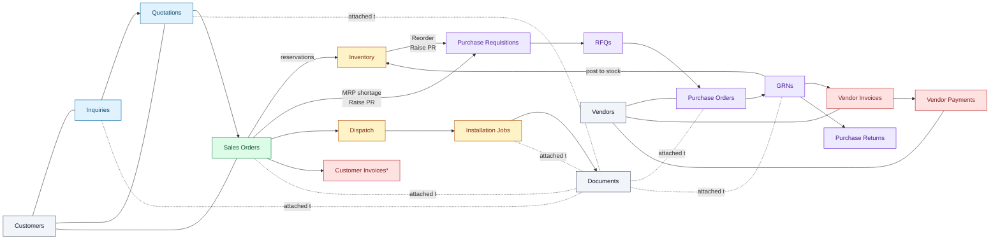

`*` Customer Invoices fall under Sales Orders → Dispatch flow; not a separate module.

---

## 2. Lead-to-cash (Customer side)

### 2.1 Inquiry lifecycle

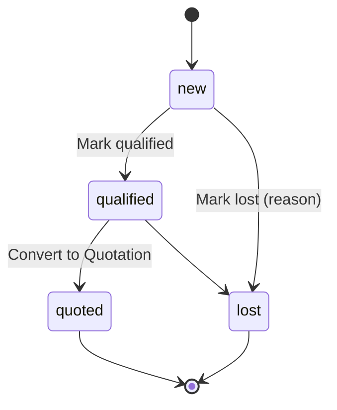

### 2.2 Quotation lifecycle

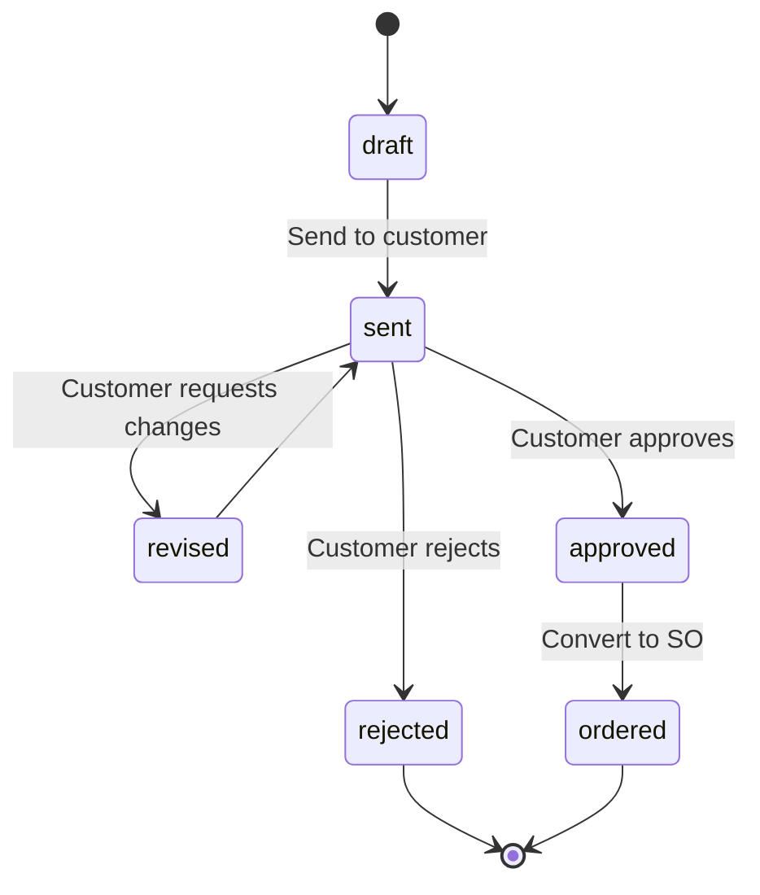

### 2.3 Sales order → dispatch → job

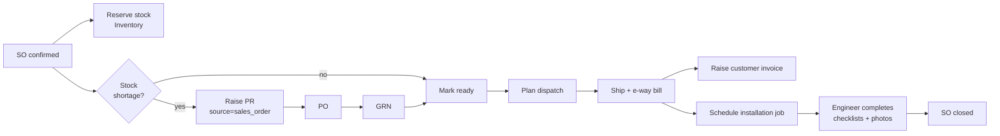

---

## 3. Procure-to-pay (Vendor side)

### 3.1 PR → RFQ → PO

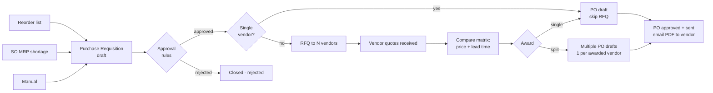

### 3.2 GRN + 3-way match

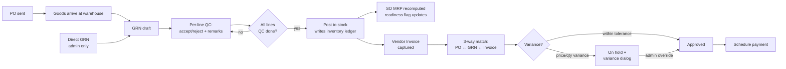

### 3.3 Payment + return

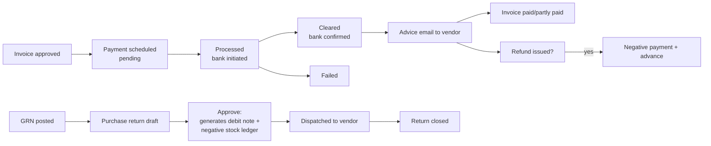

### 3.4 PO amendment

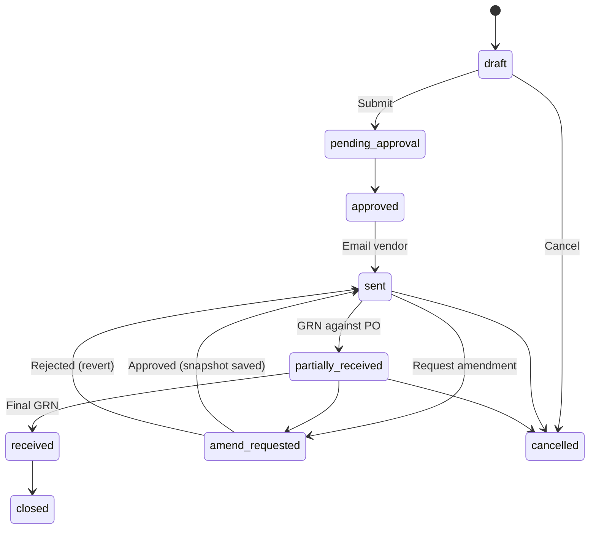

---

## 4. Inventory module

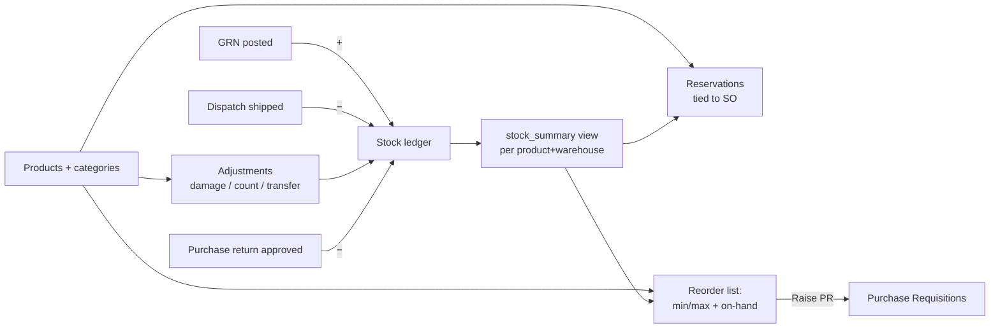

---

## 5. Cross-cutting flows

### 5.1 Documents (attachments)

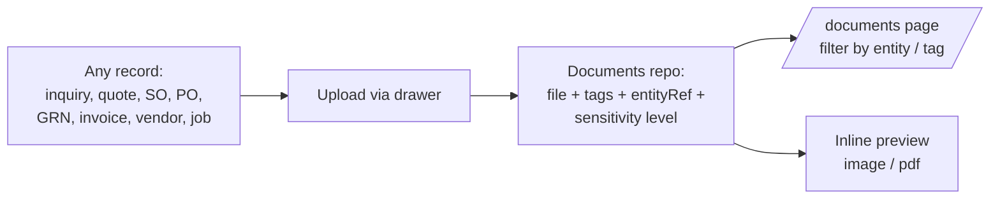

### 5.2 Search & quick-create (Topbar)

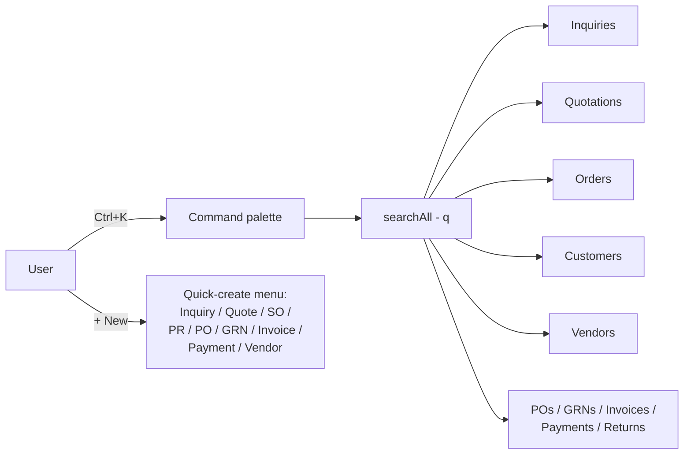

### 5.3 Notifications

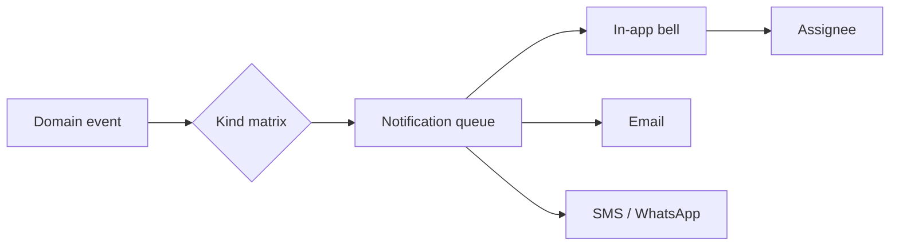

Kinds: `inquiry.assigned`, `quotation.approved`, `so.amendment_pending`, `purchase.pr.pending_approval`, `purchase.po.sent`, `purchase.invoice.variance_detected`, `purchase.invoice.due_soon`, `purchase.payment.cleared`, `purchase.vendor.blacklisted`, `dispatch.shipped`, `job.assigned`, etc. (full matrix in [Phase 2 step 13](../plan/phase-2-backend-api/13-notifications-api.md)).

### 5.4 Approval chain (generic)

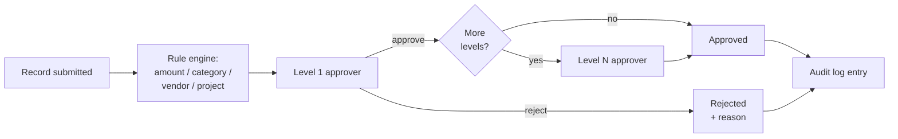

Used by: Quotations, SO amendments, PRs, POs, Vendor Invoices.

### 5.5 Audit drawer (every detail page)

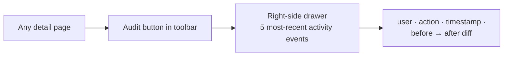

---

## 6. Roles & visibility (RBAC)

| Role               | Sales | Inventory | Purchase                | Dispatch | Jobs | Admin |
| ------------------ | ----- | --------- | ----------------------- | -------- | ---- | ----- |
| Sales Executive    | CRUD  | read      | —                       | read     | —    | —     |
| Sales Manager      | CRUD + approve | read | —                  | read     | —    | —     |
| Purchase Exec      | read  | read      | CRUD draft              | —        | —    | —     |
| Purchase Manager   | read  | read      | CRUD + approve up to limit | —     | —    | —     |
| Store Keeper       | read  | CRUD adj  | GRN CRUD                | —        | —    | —     |
| Accounts           | read  | read      | Invoices + Payments CRUD | —      | —    | —     |
| Engineer           | —     | —         | —                       | read assigned | CRUD assigned | — |
| Dispatch Co-ord    | read SO | read    | —                       | CRUD     | —    | —     |
| Admin              | full  | full      | full + settings         | full     | full | full  |

Bank details, vendor PII gated by separate `purchase.view_bank_details` permission.

---

## 7. Implementation order — verified

### Phase 1 — Static UI ✅ (done)

1. Setup → Design system → App shell → Auth.
2. Dashboard → Inquiries → Quotations → Sales Orders.
3. Inventory → Dispatch → Jobs.
4. Documents → Reports → Admin.
5. UI gap closure (search, bulk, sessions, 2FA, customer merge).
6. **Purchase & procurement** (added late so it could attach to Inventory + SO MRP — correct).

### Phase 2 — Backend API (planned, ordered)

| #   | Step                                | Why this order                                                               |
| --- | ----------------------------------- | ---------------------------------------------------------------------------- |
| 01  | Django setup                        | Foundation                                                                   |
| 02  | Models + migrations (all apps)      | One pass so foreign keys resolve; **Purchase models added in same step**     |
| 03  | Auth + JWT + RBAC                   | Every later endpoint requires it                                             |
| 04  | Shared masters (customers etc.)     | Customers FK from Inquiries, Quotations, SOs                                 |
| 04b | Settings (numbering, templates)     | Numbering series consumed by every doc; **9 purchase series included**       |
| 04c | Global search registry              | Picks up new types as modules go live                                        |
| 05  | Inquiries                           | Top of the funnel                                                            |
| 06  | Quotations                          | Depends on inquiry FK                                                        |
| 07  | Sales Orders                        | Depends on quotation FK; **adds `/orders/:id/raise-prs` for MRP→PR**         |
| 08  | Inventory                           | Stock ledger + reservations + reorder                                        |
| 08b | **Purchase**                        | Depends on Inventory ledger (GRN posts here) and SO (MRP→PR)                 |
| 09  | Dispatch                            | Depends on SO + Inventory                                                    |
| 10  | Jobs                                | Depends on dispatch + SO                                                     |
| 11  | Documents                           | Polymorphic attachments — added once all entity types exist                  |
| 11b | Client portal API                   | Scoped JWT realm; reuses existing models                                     |
| 12  | Reports                             | Read-only aggregations; depends on all previous                              |
| 13  | Notifications + background jobs     | Wires producers from every previous step                                     |
| 14  | Postman + Newman                    | After endpoints stabilise                                                    |
| 15  | Pytest + coverage gates             | Final acceptance bar                                                         |

### Phase 3 — Dynamic integration (planned)

Module wiring order will follow Phase 1 order exactly: Dashboard → Inquiries → Quotations → SO → Inventory → **Purchase** → Dispatch → Jobs → Documents → Reports → Admin → **Customers / Vendors** masters last (they're foreign-key targets, used everywhere; lowest blast radius if swapped last).

---

## 8. Gap analysis (UI vs. API plan)

### 8.1 Findings

| #  | Area                                | Gap                                                                                                | Impact / Action                                                              |
| -- | ----------------------------------- | -------------------------------------------------------------------------------------------------- | ---------------------------------------------------------------------------- |
| G1 | Phase 3 wiring order list           | `phase-3/03-modules-wiring.md` lists 10 modules but **omits Customers and Purchase**.              | Add both to keep parity with Phase 1.                                        |
| G2 | SO Detail "Raise PR" CTA            | UI navigates to `/purchase/requisitions?source=sales_order&id={soId}`. Backend endpoint exists in plan (`POST /api/v1/orders/:id/raise-prs`) but not exposed in `07-orders-api.md` table — only mentioned in 08b. | Cross-link in `07-orders-api.md`.                                            |
| G3 | Phase 1 Customers module            | Built in step 16 (gap closure) — flows + merge are implemented; no separate plan file lists every screen.  | Document customer flows here (done in §2 above).                             |
| G4 | Client portal frontend              | API plan has `11b-client-portal-api.md`; no Phase 1 step or frontend pages for portal yet.         | Decide: scope portal as Phase 4 or extend Phase 1 with `18-client-portal.md`.|
| G5 | Customer Invoices UI                | SO Detail has "Raise Invoice" button; standalone customer-invoice list/detail pages don't exist.   | Either treat invoices as SO sub-tab (current) or add list/detail screens.    |
| G6 | Tax / HSN master                    | Settings page has tax-rules tab; no dedicated HSN code master in UI.                               | Confirm with client whether HSN search-from-master is needed pre-launch.     |
| G7 | Payment advance allocation UI       | API has `/payments/allocate-advance`; PaymentListPage offers refund + new payment but no allocate-advance dialog. | Add a "Allocate advance" entry in payment row menu in Phase 1.5 if needed.   |
| G8 | Approval inbox page                 | Approvals show as banners on detail pages; there's no central "My approvals" inbox.                | Decide if a global queue is required (admins find it useful).                |
| G9 | Bulk QC on GRN list                 | Plan has `/grns/bulk-submit-qc`; UI list page lacks bulk QC button.                                | Low priority — admins do QC per-line on detail; flag for later.              |
| G10 | Vendor scorecard cache freshness UI | API exposes nightly cache; UI shows live data only.                                                | Add "Last refreshed" tag on vendor performance tab when wired.               |

### 8.2 Recommended fix-ups before client sign-off

Only G1, G2, G4 affect plan correctness; the rest are scope decisions. Suggested actions:

- **G1**: update `phase-3-dynamic-integration/03-modules-wiring.md` to include Customers and Purchase in the order list.
- **G2**: cross-reference `POST /api/v1/orders/:id/raise-prs` inside `phase-2-backend-api/07-orders-api.md`.
- **G4**: agree with client whether the client-portal UI is part of v1 launch or a follow-up phase. The API is already planned; only the UI screens need scheduling.

Everything else (G3, G5–G10) is feature scope to confirm with the client during the sign-off review.

---

## 9. Sign-off checklist for client

Please review and confirm:

1. The 7 module flows above (§2 + §3 + §4 + §5) match your business process.
2. The **state machines** (Inquiry, Quotation, SO, PR, PO, GRN, Invoice, Payment, Return, Amendment) reflect the steps your team actually performs — flag any missing transitions or extra states.
3. The **role visibility table** (§6) matches who can see and do what.
4. The **implementation order** (§7) is acceptable.
5. The **gap items** in §8 are accepted scope decisions or queued as separate change requests.

Once these five points are signed off, Phase 2 backend implementation can begin against the exact field set already shown in the static UI.
